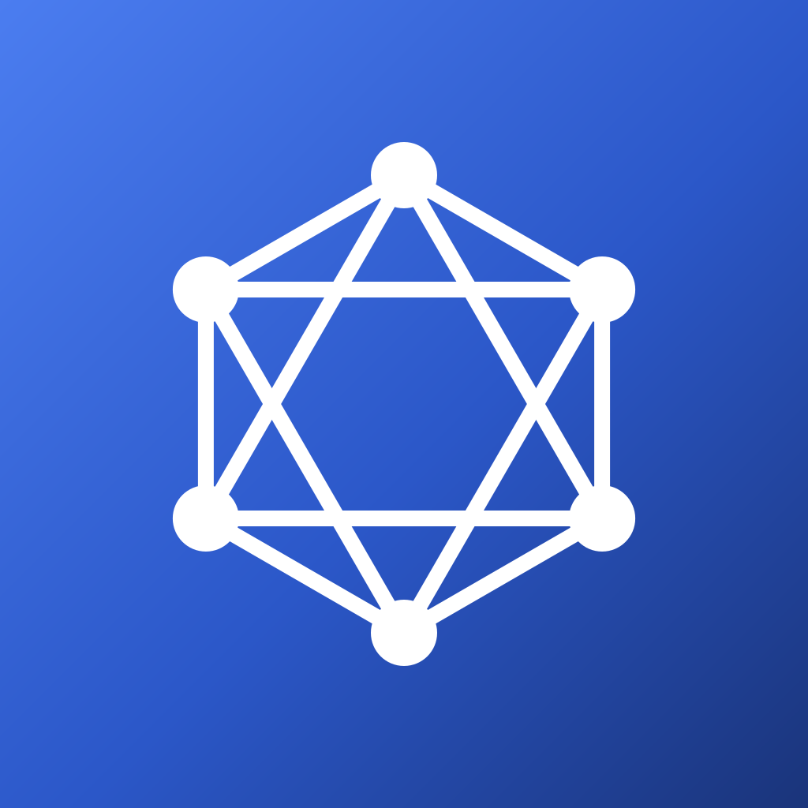
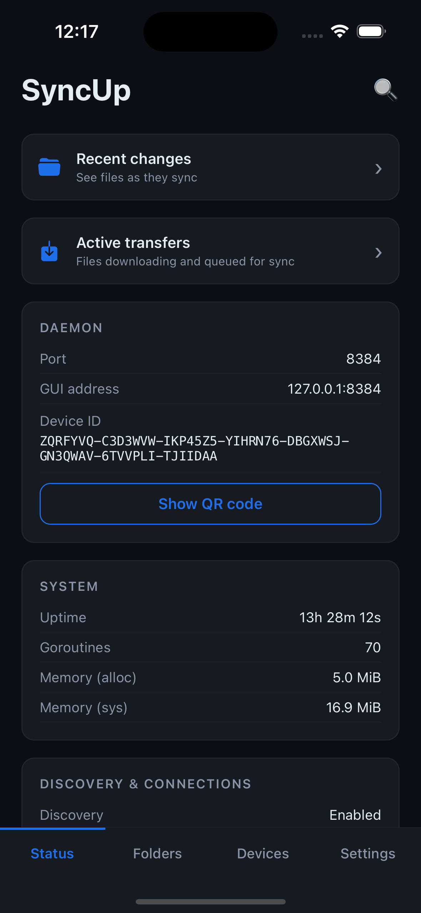
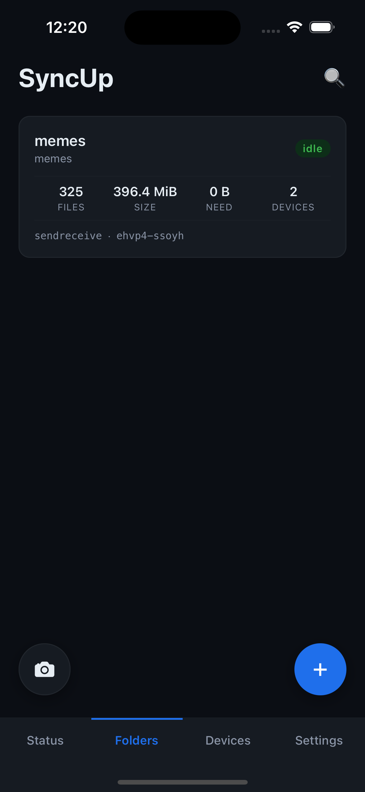
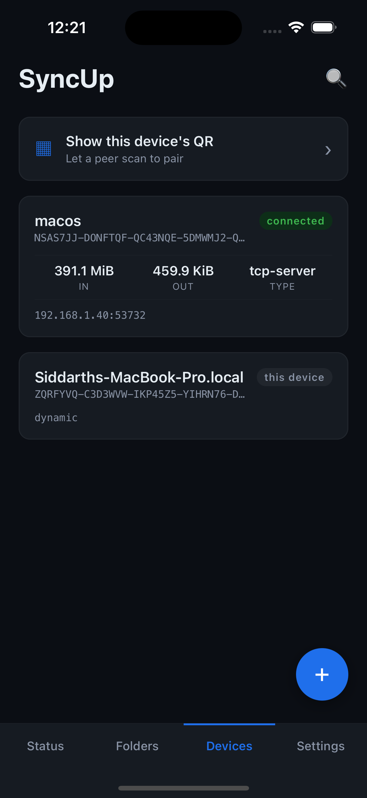
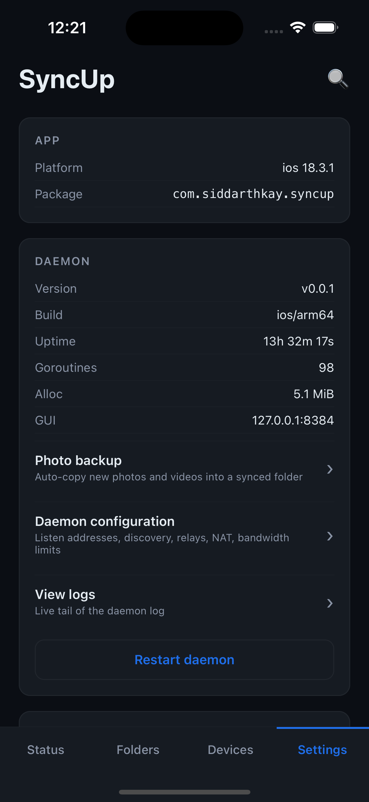
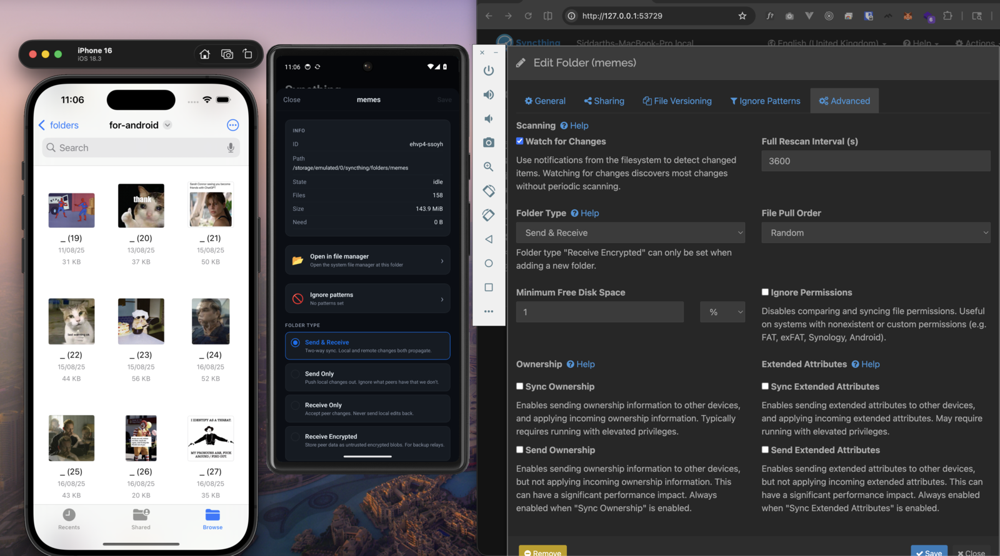

<p align="center">
  
</p>

<h1 align="center">SyncUp</h1>

<p align="center">
  An open-source Syncthing client for iPhone and Android, powered by the Syncthing daemon via gomobile.
</p>

<p align="center">
  <a href="https://github.com/siddarthkay/syncthing-app/actions/workflows/ci.yml"></a>
  <a href="LICENSE"></a>
</p>

---

Syncthing's official Android client was archived in December 2024.
No single client ran on both phones from one codebase, so I built
this. The daemon runs in-process via
[`gomobile`](https://pkg.go.dev/golang.org/x/mobile), with a React
Native UI scaffolded from
[react-native-go](https://github.com/siddarthkay/react-native-go).

## Screenshots

<!-- TODO: add screenshots -->

| Status | Folders | Devices | Settings |
|--------|---------|---------|----------|
|  |  |  |  |

<details>
<summary>Cross-platform sync demo</summary>

<p align="center">
  
</p>

</details>

## Differences from other clients

- **Daemon runs in-process on Android.** The `Go` daemon lives inside
  the app via `gomobile`. There is no subprocess to manage, no IPC
  between a background service and the UI, and no service-restart
  handling.
- **Auto-accept folders from trusted peers.** When you add a peer, you
  can toggle auto-accept so any folder they share is added to your
  device automatically without a prompt. Other pending offers show up
  as accept/ignore cards in the Folders tab.
- **QR pairing works both ways.** Display your device's QR for a peer
  to scan, or scan theirs. The 56-character device ID never needs to
  be typed by hand.
- **UI updates in near real time.** Long-polling `/rest/events` means
  config changes, folder state, and incoming offers reach the UI in
  about a second, instead of on a polling interval.

## Obsidian users

If you use Obsidian and were considering Sync ($96/yr) just for
cross-device note syncing, SyncUp covers that case. Pick "Obsidian
vault" when adding the folder and SyncUp configures the rescan interval,
ignore patterns, and watcher to match how Obsidian writes files. Apply
the preset retroactively from the folder detail screen if `.obsidian/`
is detected. Conflicts on `.md` files get a 3-way merge view.

Setup guide: [docs/OBSIDIAN.md](docs/OBSIDIAN.md).

## Status

The first real milestone was an iOS simulator, an Android emulator, and
a desktop Syncthing node all sharing the same folder and moving files
between them. The codebase is at v0. Nothing is on an app store yet;
the release process is documented in
[docs/RELEASE.md](docs/RELEASE.md).

## Architecture

The React Native UI talks to the embedded daemon over its REST API at
`127.0.0.1:8384`. A `TurboModule` implemented in `Swift` and `Kotlin`
handles daemon lifecycle, preferences, and sandbox filesystem helpers.
The `Go` side (`backend/wrapper.go`) wraps
`github.com/syncthing/syncthing/lib/syncthing` and is bound through
`gomobile`.

Folders, devices, and events are not re-exported as `gomobile` types.
That path runs into the marshaller's constraints quickly. Everything
outside lifecycle calls goes through `fetch('/rest/...')` instead,
which has been simpler to work with.

## Build

Every `make` target runs inside a Nix shell automatically — you don't
need to install Go, Node, or JDK yourself. The only prerequisites are:

- **[Nix](https://nixos.org/download/)** (with flakes enabled)
- **Xcode 16+** (iOS, macOS only — not available through Nix)
- **Android SDK** with **NDK r26** (Android — install via Android Studio)

If you prefer managing all tools yourself, pass `SYSTEM=1` to bypass
Nix:

```bash
make sim-ios SYSTEM=1
```

In that case you need: Go 1.25+, Node 20+ with Corepack enabled for
Yarn 4, JDK 17, CocoaPods, and the Android SDK/NDK listed above.

### Release builds

```
make setup         # install Go toolchain + Node deps
make ios           # Go backend + iOS simulator build
make android       # Go backend + debug-signed APK
make sim-ios       # build + install + launch on simulator
make sim-android   # build + install + launch on emulator
make test          # Go + Android + iOS + JS tests
make clean
```

A cold build takes about six minutes for iOS and three for Android on
an M2. Subsequent builds are faster once `gomobile` is cached.

### Dev builds

For iterative development with hot reload:

```
make dev-ios       # build Go backend + start Expo dev client (iOS)
make dev-android   # build Go backend + start Expo dev client (Android)
```

JS/TS changes reload instantly. Go changes require restarting the
dev target.

### Lint & typecheck

```
cd mobile-app
yarn lint
yarn typecheck
```

CI runs lint, typecheck, and `go vet -tags noassets ./...`.

## Background sync

Android keeps the daemon running in the background while the system
allows it. Settings exposes wifi-only and charging-only toggles that
drive the run-condition monitor.

iOS is more constrained. Apple does not permit continuous background
execution for apps outside the VoIP and audio categories, and this
app does not qualify. It registers two `BGTaskScheduler` jobs and gets
roughly one to two hours of opportunistic sync per day, sometimes with
multi-hour gaps between runs.

If you want a node that is genuinely always online, run Syncthing on a
desktop or server that stays up 24/7. Your phone remains opportunistic
on its own, but it reconciles against a complete copy whenever it
wakes up, instead of depending on other peers being online at the same
time.

Android folders live under app-scoped external storage at
`/storage/emulated/0/Android/data/com.siddarthkay.syncup/...` and
are deleted when the app is uninstalled.

## Contributing

See [CONTRIBUTING.md](CONTRIBUTING.md).

## Inspiration

- [pixelspark/sushitrain](https://github.com/pixelspark/sushitrain)
- [researchxxl/syncthing-android](https://github.com/researchxxl/syncthing-android)
- [siddarthkay/react-native-go](https://github.com/siddarthkay/react-native-go)

## Support the project

If this is useful to you, a GitHub star is the signal I watch to
decide what's worth continuing. Sponsorships cover the Apple developer
account and testing devices, and they let me spend time on the harder
iOS background work instead of billable client work.

- [Star on GitHub](https://github.com/siddarthkay/syncthing-app)
- [Sponsor on GitHub](https://github.com/sponsors/siddarthkay)

## License

MPL-2.0. See [LICENSE](LICENSE).
